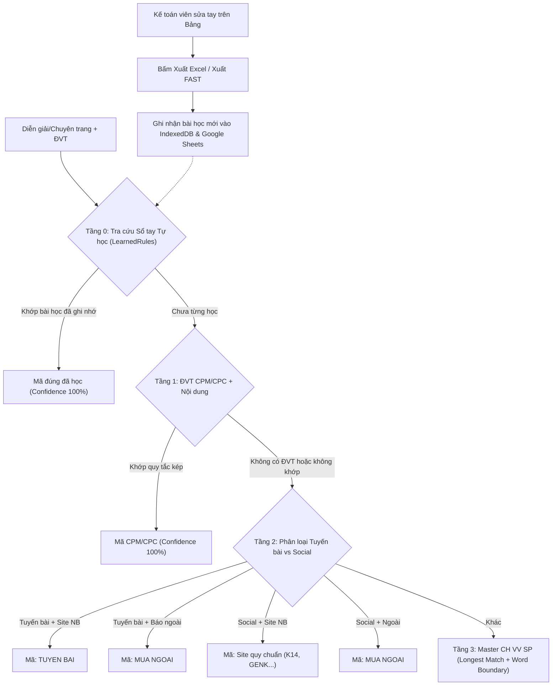

# Feature Plan: Động Cơ Tự Học Từ Lịch Sử Sửa Sai & Chuẩn Hóa Nhận Diện Mã Vụ Việc

> **Trạng thái**: 🔄 Chờ phê duyệt
> **Feature Slug**: `feedback-driven-learning-matching`
> **Ngày khởi tạo**: 2026-09-21
> **Người thực hiện**: Antigravity Pair Programmer & CaoBV

---

## 1. Bối cảnh & Mục tiêu nghiệp vụ

### 1.1 Vấn đề hiện tại
- Nhận diện mã vụ việc và sản phẩm trên hợp đồng, bảng kê phụ thuộc vào danh mục cố định trong file Excel mẫu.
- Phát sinh nhiều lỗi lệch mã thực tế (như kiểm thử trên file `import_hop_dong_cu_2026-09-21-loi.xlsx`):
  1. Tuyến bài trên Site nội bộ (Kenh14, GenK, Cafebiz...) bị nhận diện nhầm sang mã Site của Fanpage (`K14`, `GENK`...).
  2. Lệch ký tự gạch nối en-dash `–` khiến các từ khóa dài như `"Marketing fee – Chi phí marketing"` bị cướp quyền ưu tiên bởi từ ngắn `"Admatic"`.
  3. Tuyến bài trên các báo ngoài không có đuôi domain (như *Tuổi trẻ*, *Thanh niên*) bị trôi xuống gán nhầm thành `TUYEN BAI` thay vì `MUA NGOAI`.
- Thiếu cơ chế ghi nhớ khi kế toán viên sửa tay: Khi kế toán sửa một dòng cá biệt trên giao diện, lần sau nạp file mới hệ thống lại đoán sai như cũ, buộc kế toán phải sửa lại bằng tay.

### 1.2 Mục tiêu đề ra
Xây dựng mô hình **4 Tầng** nhận diện thông minh, kết hợp:
- **Tầng 0 (Động cơ Tự học - Correction Memory):** Ghi nhớ các dòng kế toán đã sửa tay tại thời điểm Xuất file (Export). Lần sau gặp lại chuỗi tương tự, tự động áp dụng 100% mã đúng mà kế toán đã dạy. Chạy hoàn toàn offline trong trình duyệt, đồng bộ lên Google Sheets tab `LearnedRules`, không dùng API bên ngoài.
- **Tầng 1:** Khớp quy tắc kép có ĐVT (CPM/CPC).
- **Tầng 2:** Phân biệt Tuyến bài (Site NB = `TUYEN BAI`, Báo ngoài = `MUA NGOAI`) vs Social (Site NB = mã Site, Báo ngoài = `MUA NGOAI`).
- **Tầng 3:** Longest match, Word boundary cho từ khóa ngắn.

---

## 2. Thiết kế kiến trúc & Data Flow

---

## 3. Kế hoạch Phase

- **Phase 1: Foundation, Types & Core Engine**
  - Cập nhật `types.ts`: `LearnedRule`, `SiteMaster`, `ProductMaster`.
  - Cập nhật `businessLogic.ts`: Chuẩn hóa dấu gạch ngang trong `normalizeText()`, thuật toán 4 tầng nhận diện `matchProductAdvanced`.
  - Cập nhật `dbService.ts`: CRUD `LearnedRules`, `SiteMaster`, đồng bộ Google Sheets.
  - Test độc lập kiểm chứng 68 dòng file lỗi.
- **Phase 2: UI & Feedback Learning Integration**
  - Tích hợp Tầng 0 vào `BangKeView`, `HopDongMoiView`, `LuanChuyenView`.
  - Bổ sung trigger tự học tại thời điểm Xuất file (Export).
  - Cập nhật `SettingsView`: Quản lý Master 4 (Site NB) và Sổ tay quy tắc tự học.
- **Phase 3: Verification & Polish**
  - Kiểm thử mô phỏng học và áp dụng bài học.
  - Chạy toàn bộ test suites cho 4 mẫu bảng kê.
